<div align="center">

# Laravel Invitations

**The enterprise invite‑by‑code, referral, rewards, waitlist & anti‑abuse suite for Laravel.**

Multi‑tenant · concurrency‑safe · idempotent redemption · GDPR‑ready · tri‑surface (PHP + HTTP API + MCP)

[](https://packagist.org/packages/padosoft/laravel-invitations)
[](https://github.com/padosoft/laravel-invitations/actions)
[](https://www.php.net)
[](https://laravel.com)
[](LICENSE)

</div>

> ⚠️ **Active development toward `v1.0.0`.** The engine is production‑proven (extracted from a
> shipping app) and fully tested; the public API may still shift before the `v1.0.0` tag.

---

## 🚀 AI vibe‑coding pack included

This repo ships a complete AI pair‑programming kit: [`CLAUDE.md`](CLAUDE.md) (engineering invariants
+ quality gates), [`AGENTS.md`](AGENTS.md), and the design/roadmap docs under [`docs/`](docs). Point
Claude Code, Cursor, or Copilot at the repo and they inherit the package's rules (atomic redemption,
tenant scoping, fail‑open fraud, GRANT‑never‑REVOKE) automatically.

---

## Why this package

Every Laravel invite/referral package on the market stops at "generate a code, mark it used." None of
them solve the problems that actually bite in production:

- **They over‑redeem under load.** The popular packages increment a use‑counter with a check‑then‑write
  and *no lock* — two concurrent redemptions both pass the "1 seat left" check. That's a free‑code /
  over‑capacity bug at best.
- **They're single‑tenant.** Codes are globally unique, so two customers can never share an intuitive
  code, and rows leak across tenant boundaries.
- **They store invitee emails forever** with no erasure path — a GDPR liability.
- **They have no events, no fraud controls, no analytics, and no API/MCP surface.**

`padosoft/laravel-invitations` is built the other way around: correctness, multi‑tenancy, privacy and
observability first.

## ✨ Highlights

- 🎟️ **Invite codes** — random, vanity, and **cryptographically signed** (Crockford Base32, no
  confusable characters), with expiry, max‑uses and per‑user limits.
- ⚛️ **Atomic, idempotent, concurrency‑safe redemption** — a single conditional
  `UPDATE … WHERE current_uses < max_uses` that flips state in the same statement, backed by a
  `UNIQUE(code_id, redeemer_id)` index. `current_uses` can **never** exceed `max_uses`; a replay is a
  no‑op, never a double‑grant — even under a thundering herd.
- 🏢 **Multi‑tenant by design** — every table is tenant‑scoped; two tenants can share the same human
  code. Single‑tenant apps get a zero‑config default.
- 🎁 **Referral graph + double‑sided rewards** with a DB‑backed idempotency key (no double‑grants).
- 📨 **Email invitations** — idempotent send/accept lifecycle, "who accepted vs. who didn't".
- 🛡️ **Fail‑open anti‑abuse** — weighted velocity / disposable‑email / honeypot / blacklist scoring
  that surfaces a generic `rate_limited` (never a probing oracle) and stores **HMAC‑hashed** PII only.
  A detector fault never blocks a real user; seat safety is the atomic claim's job.
- 🔑 **Per‑invite entitlement grants** — an invite can grant a role and project access on redemption,
  across one *or several* tenants. **GRANT‑never‑REVOKE**: it only ever raises access.
- 📈 **Virality analytics** — K‑factor, acceptance / conversion rates, time‑to‑redeem percentiles,
  reconciled against the canonical rows (not a drifting rollup).
- 🔔 **Events** on every lifecycle transition.
- 🔒 **GDPR** — in‑place PII anonymization that **preserves aggregates** + a scheduled prune command.
- 🧩 **Tri‑surface** — the same core is reachable from **PHP** (services + Artisan), a **REST API**
  (RBAC‑gated, publishable routes), and **MCP** tools.
- 🤝 **Vendor‑neutral** — works on plain Fortify/Breeze; `spatie/laravel-permission`, `laravel/fortify`
  and `laravel/mcp` are optional, first‑class integrations.

## How it compares

| Capability | **laravel‑invitations** | doorman | mateusjunges/invite‑codes | pdazcom/referrals | taldres/waitlist |
|---|:---:|:---:|:---:|:---:|:---:|
| Invite codes (max‑uses) | ✅ | ✅ | ✅ | — | — |
| **Concurrency‑safe redemption** | ✅ | ❌ | ❌ | — | — |
| **Idempotent replay** | ✅ | ❌ | ❌ | ⚠️ | ⚠️ |
| **Multi‑tenant scoping** | ✅ | ❌ | ❌ | ❌ | ❌ |
| Vanity / signed codes | ✅ | ❌ | ⚠️ | — | ⚠️ |
| Email invitations | ✅ | ✅ | ⚠️ | ❌ | ⚠️ |
| Referral graph + double‑sided rewards | ✅ | ❌ | ❌ | ⚠️ referrer‑only | ❌ |
| **Anti‑abuse / fraud** | ✅ | ❌ | ❌ | ⚠️ self‑ref only | ❌ |
| Per‑invite role/entitlement grant | ✅ | ❌ | ❌ | ❌ | ❌ |
| Virality analytics (K‑factor) | ✅ | ❌ | ❌ | ❌ | ❌ |
| GDPR erasure | ✅ | ❌ | ❌ | ❌ | ✅ |
| Events / hooks | ✅ | ❌ | ✅ | ✅ | ✅ |
| HTTP API + **MCP** surface | ✅ | ❌ | ❌ | ❌ | ❌ |

## Requirements

- PHP `^8.3`
- Laravel `^12.0 | ^13.0`

## Installation

```bash
composer require padosoft/laravel-invitations
php artisan migrate
```

Make your user model invitation‑aware:

```php
use Illuminate\Foundation\Auth\User as Authenticatable;
use Padosoft\Invitations\Concerns\InteractsWithInvitations;
use Padosoft\Invitations\Contracts\InvitedAccount;

class User extends Authenticatable implements InvitedAccount
{
    use InteractsWithInvitations; // reads `email` + auth guard for the engine
}
```

Publish the config (optional):

```bash
php artisan vendor:publish --tag=invitations-config
```

## Quick start

**Generate codes** (PHP):

```php
use Padosoft\Invitations\Services\CodeGenerator;

$code = app(CodeGenerator::class)->generateRandom(['max_uses' => 100]);
$batch = app(CodeGenerator::class)->generateBatch(500); // 500 distinct codes
```

**Redeem a code** — atomic, idempotent, fraud‑gated:

```php
use Padosoft\Invitations\Services\RedemptionService;

$result = app(RedemptionService::class)->redeem($rawCode, $user, [
    'ip' => $request->ip(),
    'fingerprint' => $request->header('X-Device'),
]);

if ($result->ok) {
    // $result->already === true on an idempotent replay (no second grant)
    // $result->redemption, $result->referral
} else {
    // $result->error: invalid | expired | exhausted | revoked | ineligible | rate_limited
}
```

**Over the REST API** (routes auto‑register; attach your own auth/RBAC via config):

```http
POST /api/invitations/redeem      { "code": "Q7K92MNP" }
POST /api/invitations/validate    { "code": "Q7K92MNP" }   # advisory, writes nothing
GET  /api/admin/invitations/metrics
POST /api/admin/invitations/codes { "count": 50, "max_uses": 1 }
```

**Over MCP** — register the bundled tools on your server:

```php
// app/Mcp/Servers/YourServer.php
public array $tools = [
    \Padosoft\Invitations\Mcp\Tools\InviteValidateCodeTool::class,
    \Padosoft\Invitations\Mcp\Tools\InviteGenerateCodesTool::class,
    \Padosoft\Invitations\Mcp\Tools\InviteMetricsTool::class,
];
```

## Architecture

```mermaid
flowchart LR
    Caller["PHP · HTTP API · MCP · CLI"] --> RS[RedemptionService]
    RS -->|validate| CV[CodeValidator]
    RS -->|fail-open gate| FD[FraudDetector]
    RS -->|atomic UPDATE + UNIQUE| DB[(invite_codes / invite_redemptions)]
    RS -->|attribute| REF[ReferralService] --> RE[RewardEngine]
    RS -->|GRANT-never-REVOKE| PROV[Provisioner&#42;]
    RS -->|fire once| EV([CodeRedeemed event])
    MS[MetricsService] --> DB
```



`*` Provisioners are pluggable: the `SpatiePermissionProvisioner` (role grant) ships by default; a host
adds its own under the `invitations.provisioners` tag.

## Host integration seams

The engine never hard‑codes your app. Three small seams keep it vendor‑neutral:

| Seam | Default | Override when… |
|---|---|---|
| `Contracts\TenantResolver` | single‑tenant (`'default'`) | you're multi‑tenant — bind your own resolver |
| `Contracts\Provisioner` (tag `invitations.provisioners`) | `SpatiePermissionProvisioner` (role) | you grant more on redemption (e.g. team/project membership) |
| `Contracts\InvitedAccount` | `InteractsWithInvitations` trait | your user model stores email differently |

```php
// A multi-tenant host, in a service provider:
$this->app->bind(\Padosoft\Invitations\Contracts\TenantResolver::class, MyTenantResolver::class);
$this->app->tag([MyProjectMembershipProvisioner::class], 'invitations.provisioners');
```

## Events

`CodeRedeemed` (fired **once**, on a fresh claim — never on an idempotent replay), `InvitationSent`,
`InvitationAccepted`. Listen to grant perks, send a welcome, or update your own projections.

## GDPR

PII (ip / fingerprint / recipient) is stored hashed or anonymizable. The scheduled sweep anonymizes
rows past the retention window **in place** — `current_uses`, funnel counts and K‑factor are untouched:

```bash
php artisan invite:prune-pii --days=90
```

## Configuration

All knobs live in `config/invitations.php` and are env‑overridable — code alphabet/length, signing key,
PII retention, anti‑abuse thresholds/velocity/blocklists, and the route prefix + per‑surface middleware
(attach your RBAC gate to `invitations.routes.admin_middleware`).

## Companion package

[`padosoft/laravel-invitations-admin`](https://github.com/padosoft/laravel-invitations-admin) ships a
React + Tailwind admin SPA over this package's API — campaigns, codes, invitations, referral graph,
reward ledger, waitlist, anti‑abuse review and the virality dashboard.

## Testing

```bash
composer test       # PHPUnit (Testbench)
composer analyse    # PHPStan
composer check      # format + analyse + test
```

## License

MIT © [Padosoft](https://www.padosoft.com). See [LICENSE](LICENSE).
