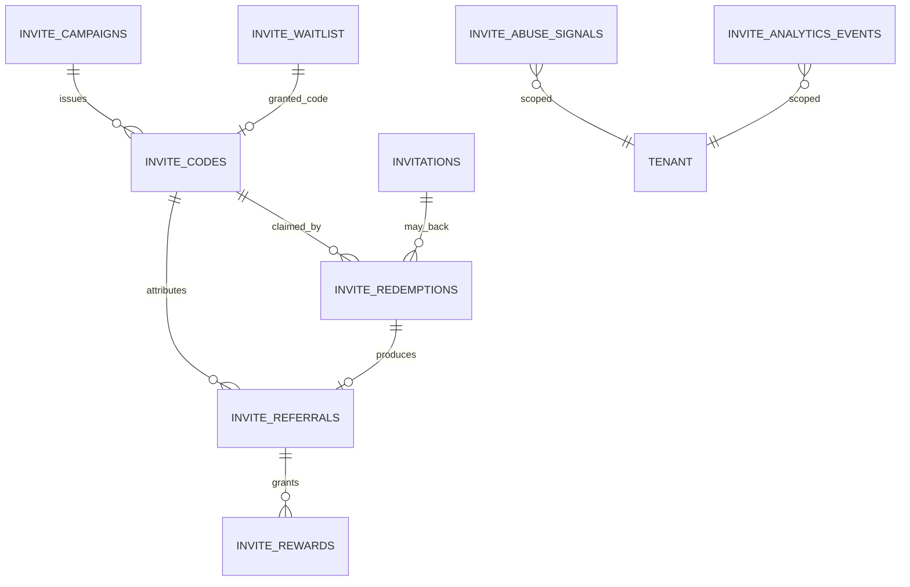

# Data model

## Motivation

The package's invariants are not code‑path discipline — they are **database constraints**. Capacity is
a `CHECK`, idempotency is a `UNIQUE` index, tenant isolation is a leading `tenant_id` on every
composite key. This page is the map of the nine tables and the constraints that make the guarantees
true regardless of the calling code.

## Entity map



## The nine tables

| Table | Purpose | Key constraints |
|---|---|---|
| `invite_campaigns` | issuing policy + reward policy + grant template | `UNIQUE(tenant_id, key)` |
| `invite_codes` | the redeemable token | `UNIQUE(tenant_id, code)`, `CHECK(current_uses <= max_uses)`, state/kind `CHECK` |
| `invitations` | email invitation lifecycle | high‑entropy `token`, recipient PII |
| `invite_redemptions` | immutable claim event (append‑only) | `UNIQUE(code_id, redeemer_id)` — the idempotency anchor |
| `invite_referrals` | referral edges | `UNIQUE(tenant_id, referee_id)` — one referrer per referee |
| `invite_rewards` | reward ledger | `UNIQUE(idempotency_key)` — no double‑grants |
| `invite_waitlist` | viral waitlist | `UNIQUE(tenant_id, email)`, `position` + `priority` |
| `invite_abuse_signals` | abuse audit trail (hashed PII) | tenant‑scoped, subject hashed |
| `invite_analytics_events` | funnel event log | idempotent on a deterministic dedupe key |

Every table carries `tenant_id` (`default 'default'`, indexed) and every composite unique starts with
it (see [Multi‑tenancy](/concepts/multi-tenancy)).

## `invite_codes` — the capacity‑bearing table

```php
$table->string('tenant_id', 50)->default('default')->index();
$table->unsignedBigInteger('campaign_id')->nullable(); // null = standalone code
$table->string('code', 64);                            // normalized form
$table->string('code_kind', 10)->default('random');    // random | vanity | signed
$table->string('state', 12)->default('active');        // active|redeemed|exhausted|expired|revoked
$table->unsignedInteger('max_uses')->default(1);
$table->unsignedInteger('current_uses')->default(0);
$table->unsignedBigInteger('issuer_id')->nullable();   // referrer attribution
$table->timestamp('expires_at')->nullable();
$table->json('payload')->nullable();                   // signed-code carried data
$table->json('grant')->nullable();                     // per-code provisioning override
$table->unique(['tenant_id', 'code'], 'uq_invite_codes_tenant_code');
```

On pgsql three CHECK constraints back the application invariants:

```sql
CHECK (current_uses <= max_uses)
CHECK (state IN ('active','redeemed','exhausted','expired','revoked'))
CHECK (code_kind IN ('random','vanity','signed'))
```

The `CHECK(current_uses <= max_uses)` is the database‑level backstop behind the
[atomic claim](/concepts/atomic-redemption): even a hypothetical bug in the application path cannot
over‑redeem past it.

## `invite_redemptions` — the idempotency anchor

```php
$table->unsignedBigInteger('code_id');
$table->unsignedBigInteger('redeemer_id');
$table->timestamp('redeemed_at');
$table->string('ip', 128)->nullable();          // hashed when stored
$table->string('user_agent')->nullable();       // truncated
$table->string('fingerprint', 128)->nullable(); // hashed when stored
$table->unique(['code_id', 'redeemer_id'], 'uq_invite_redemptions_code_redeemer');
```

The row is **append‑only** — `redeemed_at` and the identity columns are never mutated. GDPR
anonymization overwrites the **PII columns in place** so the row (and the aggregates it feeds) survives
erasure. The `UNIQUE(code_id, redeemer_id)` index is *the* idempotency guarantee.

## ADR

::: collapsible "ADR · Invariants live in the schema, not the service"
**Problem.** Capacity, idempotency, and one‑referrer‑per‑referee could be enforced purely in service
code.

**Decision.** Enforce each with a database constraint — `CHECK(current_uses <= max_uses)`,
`UNIQUE(code_id, redeemer_id)`, `UNIQUE(tenant_id, referee_id)`, `UNIQUE(idempotency_key)`.

**Consequences.** The guarantee holds under concurrent workers, against a second writer (a background
job, an admin script), and across process restarts — places where service‑only discipline silently
fails. The service still races the constraint and *handles* the violation gracefully (catch → release
→ idempotent success), but the constraint is the source of truth.
:::

::: collapsible "ADR · Append-only redemptions, anonymize-in-place"
**Problem.** GDPR erasure could delete redemption rows — but those rows feed `current_uses` and the
funnel counts.

**Decision.** Never delete; overwrite PII columns in place.

**Consequences.** After a retention sweep or erasure request, the aggregates are unchanged while the
subject's ip / fingerprint / recipient are gone. See [GDPR & data privacy](/guides/gdpr).
:::

::: callout warning
The `default('default')` on `tenant_id` is deliberate — it keeps single‑tenant and legacy rows valid
with no migration dance. Do not drop it; do not add a new tenant‑aware table without a leading
`tenant_id` on its composite uniques.
:::
