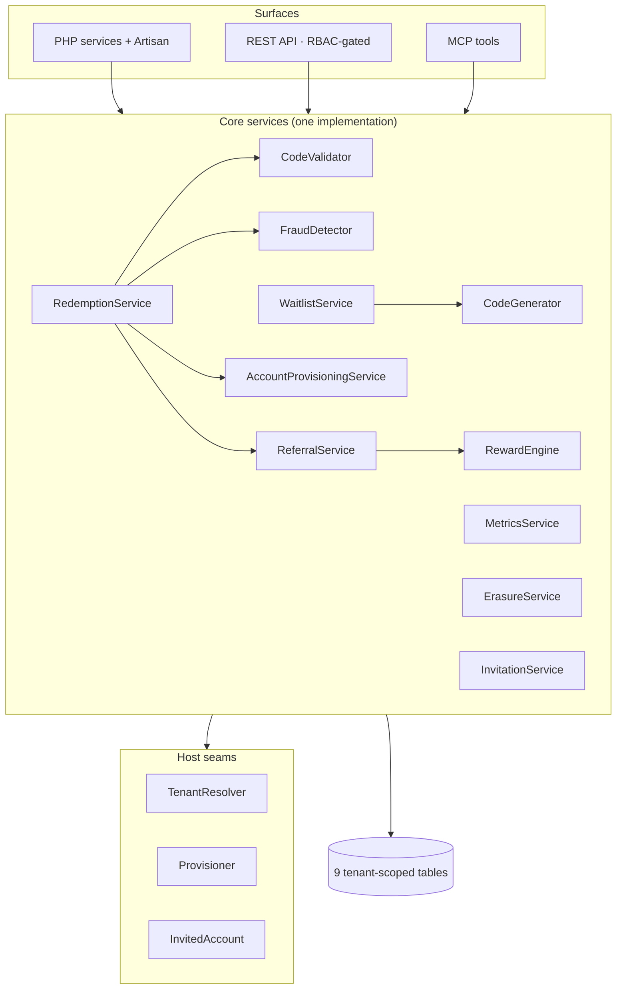

# Architecture overview

## Motivation

The package is a **headless core**: a set of focused services over tenant‑scoped tables, with no UI of
its own. Every capability is reachable from three surfaces — PHP, an HTTP API, and MCP tools — and all
three delegate to the *same* service. There is never a parallel implementation behind a surface; the
surface only adapts input → core → output. This is the host platform's R44 *tri‑surface* rule applied
to a standalone package.

## The big picture

## The services

| Service | Responsibility |
|---|---|
| `CodeGenerator` | mint random / vanity / signed codes (CSPRNG, collision‑guarded) |
| `CodeNormalizer` | fold a human code to its canonical identity (uppercase, Crockford) |
| `CodeValidator` | advisory validity check (unknown / expired / revoked / closed) |
| `RedemptionService` | the atomic, idempotent, fraud‑gated claim — the cornerstone |
| `ReferralService` | first‑wins attribution + idempotent qualification |
| `RewardEngine` | double‑sided, idempotent reward grants + reversal |
| `WaitlistService` | join / refer‑to‑jump / invite‑from‑top |
| `FraudDetector` | fail‑open, generic weighted abuse scoring |
| `MetricsService` | funnel + virality read model over canonical rows |
| `ErasureService` | GDPR retention sweep + per‑account erasure / export |
| `InvitationService` | email invitation send / accept lifecycle |
| `AccountProvisioningService` | GRANT‑never‑REVOKE provisioning via host provisioners |

## Layering rules

- **Controllers and MCP tools are thin.** They validate input, resolve the tenant, call a core
  service, and shape the response. No business logic lives in a surface.
- **Services own the logic, the audit, and the tenant scope.** A service is the single place a rule is
  implemented; the three surfaces share it.
- **The database is the source of truth.** Idempotency, capacity, and uniqueness are database
  invariants (unique indexes, CHECK constraints), not code‑path discipline.
- **Seams keep the engine vendor‑neutral.** The host binds `TenantResolver`, tags `Provisioner`s, and
  points `InvitedAccount` at its user model — see [Multi‑tenancy & host seams](/concepts/multi-tenancy).

## Where to read next

::: grids
  ::: grid
    ::: card "Redemption pipeline" icon:git-branch
    The step‑by‑step flow from raw code to committed claim.

    [Pipeline →](/architecture/pipeline)
    :::
  :::
  ::: grid
    ::: card "Data model" icon:database
    The nine tables and the constraints that enforce the invariants.

    [Data model →](/architecture/data-model)
    :::
  :::
  ::: grid
    ::: card "Decision records" icon:scroll
    The architectural decisions and their trade‑offs.

    [ADRs →](/architecture/decisions)
    :::
  :::
:::
