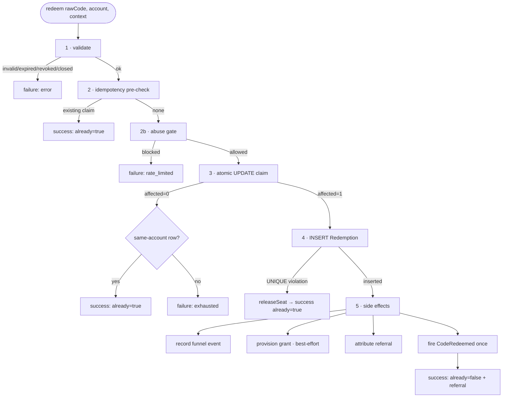

# Redemption pipeline

## Motivation

Redemption is the hot path of the whole system, and it has to be correct under concurrency, idempotent
on replay, privacy‑preserving, and observable. This page traces the full pipeline in
`RedemptionService::redeem()`, including every failure branch, so you can reason about exactly what
happens for any input.

## The pipeline



## Step by step

::: steps

1. **Validate (advisory)**
   `CodeValidator::validate()` resolves the normalized code in the current tenant and checks state,
   expiry, revocation, and campaign window. A failure returns immediately with the canonical error —
   no write has happened.

2. **Idempotency pre‑check**
   If a `Redemption` already exists for `(code, redeemer)`, return it as idempotent success
   (`already: true`). This runs **before** the abuse gate so a legitimate replay is never
   rate‑limited.

3. **Abuse gate (advisory)**
   `FraudDetector::assess()` scores the request. A `block`/`throttle` decision surfaces a **generic**
   `rate_limited`. Fail‑open: a detector fault returns `none`. See
   [Anti‑abuse scoring](/concepts/anti-abuse).

4. **Atomic claim**
   The single conditional `UPDATE` increments `current_uses` and flips `state` in one statement, gated
   on `state = 'active' AND current_uses < max_uses`. *affected‑rows = 0* means lost‑the‑race or
   exhausted — re‑check for a same‑account row before returning `exhausted`.

5. **Record + side effects**
   `INSERT` the immutable `Redemption`. A `UNIQUE(code_id, redeemer_id)` violation triggers
   `releaseSeat()` (decrement + recompute state) and returns the winner's claim. On a clean insert:
   record the funnel event, provision the grant (best‑effort), attribute the referral, and fire
   `CodeRedeemed` exactly **once**.

:::

## Failure modes & their semantics

| Outcome | `ok` | `already` | `error` | When |
|---|:---:|:---:|---|---|
| Fresh claim | ✅ | `false` | — | the redeemer wins a seat for the first time |
| Idempotent replay | ✅ | `true` | — | same account, same code, already claimed |
| Same‑account race | ✅ | `true` | — | a concurrent same‑account claim won; seat released |
| Invalid / expired / revoked | ❌ | — | `invalid` / `expired` / `revoked` | validation failed |
| Exhausted | ❌ | — | `exhausted` | no seats left and no prior claim by this account |
| Rate‑limited | ❌ | — | `rate_limited` | abuse gate blocked/throttled the fresh claim |

## Side‑effect ordering invariants

- `CodeRedeemed` fires **only** on a fresh claim — never on an idempotent replay. Listeners (perks,
  welcome mail) must not re‑run for a replay.
- Provisioning and referral attribution are **best‑effort** — their failure never fails an
  already‑committed redemption (the seat is claimed, the row is written).
- The funnel event is idempotent on the redemption id.

::: callout warning
Do not reorder the pipeline. Moving the abuse gate before the idempotency pre‑check would rate‑limit
legitimate replays; moving provisioning before the `INSERT` would grant access for a claim that might
lose the unique race. The order encodes the correctness argument.
:::

## Worked example — exhaustion vs. replay

```php
$code = app(CodeGenerator::class)->generateRandom(['max_uses' => 1]);

$first  = app(RedemptionService::class)->redeem($code->code, $alice);  // ok, already=false
$replay = app(RedemptionService::class)->redeem($code->code, $alice);  // ok, already=true (no 2nd grant)
$other  = app(RedemptionService::class)->redeem($code->code, $bob);    // !ok, error=exhausted
```
