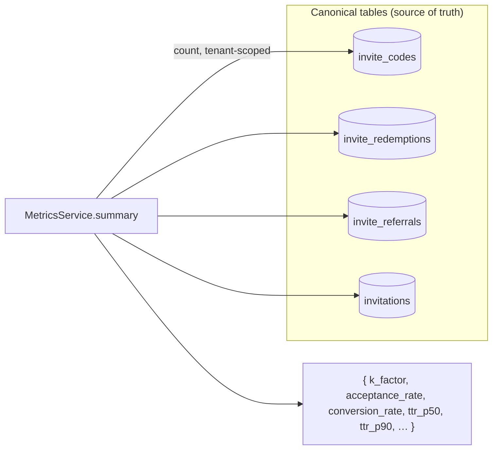

# Virality analytics (K‑factor)

## Motivation

A referral program lives or dies by one number: the **viral coefficient**, or K‑factor. If each user
brings more than one new user, growth compounds; below one, it decays. But a K‑factor computed from a
*separate rollup table* drifts from reality the first time a job is missed or a row is corrected. This
package computes every metric directly from the **canonical tables** — `Redemption`, `Referral`,
`Invitation`, `InviteCode` — so the numbers always reconcile with the raw rows.

## Theory

Let, within the chosen tenant / campaign / time window:

- $Q$ = qualified referrals (status `qualified` or `rewarded`)
- $R$ = distinct referrers
- $A_s$ = invitations sent, $A_a$ = invitations accepted
- $C_i$ = codes issued, $C_r$ = redemptions

The metrics are:

$$
K = \frac{Q}{R} \qquad \text{(viral coefficient)}
$$

$$
\text{acceptance} = \frac{A_a}{A_s} \qquad
\text{conversion} = \frac{C_r}{C_i}
$$

Each ratio is `0.0` when its denominator is zero (no division‑by‑zero, no `NaN`), and every value is
rounded to 4 decimal places. A campaign with $K \ge 1$ is self‑sustaining; the operator's job is to
move acceptance and conversion up and watch $K$ cross 1.

### Time‑to‑redeem percentiles

The **time‑to‑redeem** for a redemption is $\Delta t = t_{\text{redeem}} - t_{\text{issue}}$ in
seconds. For a percentile $p \in [0,1]$ over $n$ ordered samples, the package uses the
*nearest‑rank* offset:

$$
\text{offset} = \big\lfloor p \,(n - 1) \big\rfloor
$$

and fetches the single row at that offset — ordered **in SQL**, never loaded into PHP. `ttr_p50` and
`ttr_p90` are the median and 90th‑percentile latencies.

## Design



`MetricsService` is a pure **read model**: it issues tenant‑scoped `count`/`distinct` queries against
the canonical tables and assembles the summary. The analytics *event* log (`invite_analytics_events`)
is the audit trail of funnel transitions; the metrics service is the reconciled read over the truth.

## Data model / contract

`MetricsService::summary(?int $campaignId = null, ?int $sinceDays = null)` returns:

| Key | Type | Definition |
|---|---|---|
| `codes_issued` | `int` | codes created in scope |
| `redemptions` | `int` | redemptions in scope |
| `invites_sent` | `int` | invitations with a `sent_at` |
| `invites_accepted` | `int` | invitations with status `accepted` |
| `referrals_qualified` | `int` | referrals `qualified` or `rewarded` |
| `distinct_referrers` | `int` | distinct `referrer_id` |
| `k_factor` | `float` | $Q / R$, 4 dp |
| `acceptance_rate` | `float` | $A_a / A_s$, 4 dp |
| `conversion_rate` | `float` | $C_r / C_i$, 4 dp |
| `ttr_p50_seconds` | `?int` | median time‑to‑redeem |
| `ttr_p90_seconds` | `?int` | p90 time‑to‑redeem |

The seconds‑diff expression is driver‑aware (`EXTRACT(EPOCH …)` on pgsql, `TIMESTAMPDIFF` on
MySQL/MariaDB, `julianday(…) * 86400` on SQLite), so percentiles compute correctly on every supported
database.

## ADR

::: collapsible "ADR · Percentile in SQL, not in PHP"
**Problem.** A percentile needs an ordered dataset. The simple implementation loads every redemption
into PHP and sorts in memory.

**Decision.** Order **in SQL** and fetch the single row at the nearest‑rank offset
($\lfloor p(n-1)\rfloor$) with `OFFSET … LIMIT 1`.

**Consequences.** Memory stays bounded regardless of corpus size (host rule R3 — never load a whole
sweepable set into memory). The cost is two queries (a `count` then the offset fetch) instead of one,
a negligible price for O(1) memory.
:::

::: collapsible "ADR · Read model over canonical rows, not a rollup"
**Problem.** Aggregates can be served from a maintained rollup table (fast) or recomputed from the
canonical rows (always correct).

**Decision.** Recompute from the canonical tables on every call.

**Consequences.** The numbers never drift from the raw rows — a corrected or anonymized row is
immediately reflected, and there is no rollup job to miss. For very large corpora a cached projection
can be layered on top later; correctness is the default.
:::

## Worked example

```php
use Padosoft\Invitations\Services\MetricsService;

$m = app(MetricsService::class)->summary(campaignId: 7, sinceDays: 30);

// e.g. ['k_factor' => 1.2143, 'acceptance_rate' => 0.64, 'conversion_rate' => 0.41,
//       'ttr_p50_seconds' => 3600, 'ttr_p90_seconds' => 86400, …]

if ($m['k_factor'] >= 1.0) {
    // Self-sustaining loop — the campaign grows without paid acquisition.
}
```

The same summary is exposed over the [HTTP API](/operations/http-api)
(`GET /api/admin/invitations/metrics`) and the [`InviteMetricsTool`](/reference/mcp-tools) MCP tool —
one core service, three surfaces.

::: callout tip
GDPR anonymization overwrites **PII columns in place** and never deletes rows, so a retention sweep or
an erasure request leaves `current_uses`, the funnel counts, and the K‑factor unchanged. See
[GDPR & data privacy](/guides/gdpr).
:::
