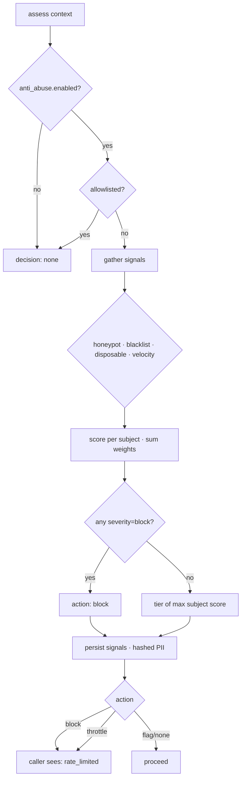

# Anti‑abuse scoring

## Motivation

An invite system is a magnet for abuse: credential‑stuffed redemptions, disposable‑email reward
farming, self‑referral loops, bot signups. But a fraud gate that is *too eager* is worse than none —
a fragile detector that throws under load would deny real users their signups, turning a defensive
control into a self‑inflicted denial‑of‑service.

The `FraudDetector` is therefore built on two iron rules:

- **Fail‑open** — any store or rule error degrades to a safe `none` decision and **never** becomes a
  block. Seat safety is the [atomic claim's](/concepts/atomic-redemption) job, not this gate's.
- **Generic** — the caller only ever learns `rate_limited`. The tripped `signal_type` is never echoed,
  so the gate cannot be used as a probing oracle to map the blocklist.

## Theory — weighted scoring per subject

A request is assessed across several **subjects**: the account, the IP (hashed), the device
fingerprint (hashed), and the email (canonicalized + hashed). Each rule that fires raises a *signal*
with a weight $w_i$ and a severity. For a subject $s$, the running score is the sum of its signal
weights inside the time window:

$$
S(s) = \sum_{i \in \text{signals}(s)} w_i
$$

The decision for the request is the **most severe** action across all subjects:

$$
\text{action} = \max_{s}\; \operatorname{tier}\!\big(S(s)\big)
$$

where $\operatorname{tier}$ maps a score onto a four‑level ladder using the configured thresholds
$\theta_{\text{flag}} \le \theta_{\text{throttle}} \le \theta_{\text{block}}$:

$$
\operatorname{tier}(S) =
\begin{cases}
\textsf{block}    & S \ge \theta_{\text{block}}    \;(\text{default } 80)\\
\textsf{throttle} & S \ge \theta_{\text{throttle}} \;(\text{default } 50)\\
\textsf{flag}     & S \ge \theta_{\text{flag}}     \;(\text{default } 25)\\
\textsf{none}     & \text{otherwise}
\end{cases}
$$

A **hard‑block** signal (blacklist, honeypot, self‑referral, fingerprint‑collision, disposable email
on a reward campaign) short‑circuits to `block` regardless of the running total — it carries severity
`block`, score `100`.

## Design



The whole pipeline is wrapped in a single `try { … } catch (Throwable) { return AbuseDecision::none(); }`
— *that* is the fail‑open guarantee. If the abuse store is down, the rules error, or anything throws,
the request proceeds. The atomic claim still guarantees a code is never over‑redeemed.

## Data model / contract

`AbuseDecision` carries the action, the max score, an optional `retry_after`, and the raw signals.
Only the action leaves the engine — and only as a boolean `blocked()` that the redemption path turns
into the generic `RateLimited` error.

Signals are persisted to `invite_abuse_signals` (tenant‑scoped) for review, with **HMAC‑hashed**
subject values — never plaintext IP / fingerprint / email:

| Signal type | Subject | Default severity | Default score |
|---|---|---|---|
| `honeypot` | IP | block | 100 |
| `blacklist` | IP / email / account | block | 100 |
| `disposable_email` | email | warn (block on a reward campaign) | 40 |
| `velocity` / `rate_limit` | account / IP / fingerprint | warn | 25–30 |
| `self_referral` | account | warn (flag) | — |

The per‑subject **velocity** rule counts prior redemptions inside a rolling window:

| Subject | Default max | Window | Score |
|---|:---:|:---:|:---:|
| account | 5 | 24 h | 30 |
| IP | 10 | 1 h | 25 |
| fingerprint | 8 | 1 h | 30 |

## ADR

::: collapsible "ADR · Fail-open, never fail-closed"
**Problem.** When the detector errors, should the request be blocked (fail‑closed, "safe by default")
or allowed (fail‑open)?

**Decision.** Fail‑open: a detector fault returns `none` and the redemption proceeds.

**Consequences.** A buggy or overloaded detector can never DoS legitimate signups. Over‑redemption is
*not* a risk here because seat safety is independently guaranteed by the atomic claim. The trade‑off
is that during an outage some abusive requests slip through the advisory gate — an acceptable cost,
since the gate is advisory and the signals are still logged for retrospective review.
:::

::: collapsible "ADR · Generic rate_limited, never the tripped rule"
**Problem.** Returning *why* a request was blocked is friendlier — but it tells an attacker exactly
which signal tripped.

**Decision.** The caller only ever receives `rate_limited`. The specific `signal_type` is recorded in
the audit table but never returned.

**Consequences.** The gate is not a probing oracle: an attacker cannot binary‑search the blocklist or
disposable‑domain list by watching which inputs change the response. The cost is slightly less helpful
client errors, mitigated by the admin review surface that *does* show the real signals.
:::

## Worked example

```php
// config/invitations.php — tighten the IP velocity rule
'anti_abuse' => [
    'velocity' => [
        'ip' => ['max' => 3, 'window' => 3600, 'score' => 60], // 60 ≥ throttle (50)
    ],
],
```

The 4th redemption from one IP in an hour now scores 60 → `throttle` → the caller sees `rate_limited`
with a `Retry-After` of `anti_abuse.retry_after` seconds. A whitelisted office IP under
`anti_abuse.allowlist.ips` skips scoring entirely.

::: callout warning
Never surface the tripped `signal_type` to the caller, and never make the gate throw on the redemption
path — both break a documented invariant. If you add a new rule, give it a weight and a severity and
let the existing tiering decide the action; do not branch the redemption path on a specific signal.
:::
