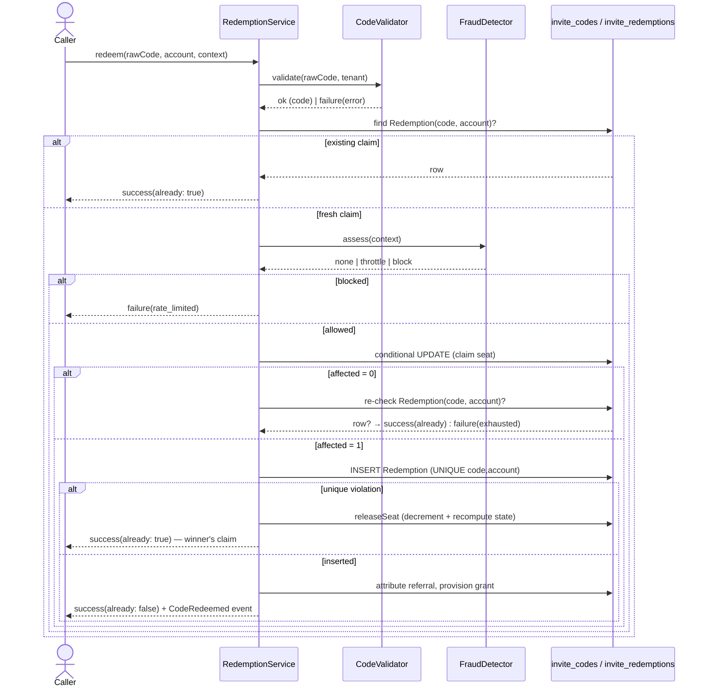
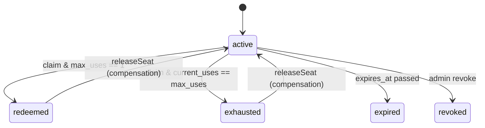

# Atomic idempotent redemption

## Motivation

Redeeming an invite code looks trivial until two requests arrive at the same millisecond. The naïve
implementation — shared by most invite/referral packages — is a *read‑then‑write*:

```php
// ❌ The bug every other package ships
$code = InviteCode::where('code', $raw)->first();
if ($code->current_uses < $code->max_uses) {   // both requests read "0 < 1" → TRUE
    $code->increment('current_uses');           // both write → current_uses = 2
}
```

Under concurrency both requests pass the check before either writes. A 1‑seat code is redeemed twice;
a 100‑seat code over‑provisions; a paid plan is granted to two accounts for one purchase. The window
is not rare — it is the *textbook* time‑of‑check / time‑of‑use (TOCTOU) race, and it widens with load.

This package treats correctness‑under‑load as the headline feature, not an afterthought.

## Theory

Let a code have capacity $m = \texttt{max\_uses}$ and a live counter $u = \texttt{current\_uses}$.
A correct redemption engine must guarantee two properties for **any** interleaving of concurrent
callers:

$$
\textbf{Safety:}\quad u \le m \quad \text{at all times}
$$

$$
\textbf{Idempotency:}\quad \big|\{\, r : (\texttt{code}, \texttt{account}_r)\,\}\big| \le 1
$$

Safety says the counter can never exceed capacity. Idempotency says a given account holds **at most
one** claim on a given code, no matter how many times it retries.

The package achieves both **without an application‑level lock** by pushing the guard into a single SQL
statement whose `WHERE` clause is the gate:

```sql
UPDATE invite_codes
   SET current_uses = current_uses + 1,
       state = CASE
                 WHEN current_uses + 1 >= max_uses AND max_uses = 1 THEN 'redeemed'
                 WHEN current_uses + 1 >= max_uses                  THEN 'exhausted'
                 ELSE state
               END
 WHERE id = :id
   AND tenant_id = :tenant
   AND state = 'active'
   AND current_uses < max_uses;
```

The database evaluates `current_uses < max_uses` and applies the increment **atomically per row**. At
most $m$ callers ever observe *affected‑rows = 1*; caller $m+1$ sees the predicate fail and gets
*affected‑rows = 0*. Safety is therefore a property of the statement, not of the code path around it.
The `CASE` flips the state in the **same** statement, so there is no window in which a fully‑consumed
code is still `active`.

Idempotency is enforced by a second, independent guard: a unique index

$$
\texttt{UNIQUE(code\_id, redeemer\_id)}
$$

on the append‑only `invite_redemptions` table. Even if two requests for the same account both win an
increment, only one `INSERT` survives; the loser catches the unique violation, **hands its
over‑counted seat back**, and returns the winner's claim as idempotent success.

## Design



The algorithm in `RedemptionService::redeem()` is exactly five steps:

1. **Validate** (advisory): unknown / expired / revoked / campaign‑closed short‑circuit before any
   write.
2. **Idempotency pre‑check**: an existing `Redemption` for `(code, redeemer)` returns idempotent
   success — *before* the abuse gate, so a legitimate replay is never rate‑limited.
3. **Atomic claim**: the conditional `UPDATE`. *affected‑rows = 0* means "lost the race / exhausted"
   — unless the redeemer already has a row (a concurrent same‑account claim committed first →
   idempotent).
4. **Insert** the `Redemption`. A `UNIQUE(code_id, redeemer_id)` violation means a concurrent
   same‑account claim beat us between step 2 and step 4: release the seat and return idempotent
   success.
5. **Side effects** on a fresh claim only: record the funnel event, provision the grant
   (best‑effort), attribute the referral, and fire `CodeRedeemed` **once**.

## Data model / contract

`RedemptionService::redeem()` returns a `RedemptionResult` value object:

| Field | Type | Meaning |
|---|---|---|
| `ok` | `bool` | the redemption succeeded (fresh **or** idempotent) |
| `already` | `bool` | `true` when this was an idempotent replay (no second grant) |
| `redemption` | `?Redemption` | the immutable claim row (present on success) |
| `referral` | `?Referral` | the attributed referral edge, if any |
| `error` | `?RedemptionError` | the failure enum on `ok = false` |

`RedemptionError` is a closed set: `Invalid`, `Expired`, `Exhausted`, `Revoked`, `Ineligible`,
`RateLimited`. The canonical lowercase string (`invalid`, `expired`, …) is what every surface emits.

The state machine on `invite_codes.state`:



A pgsql `CHECK(current_uses <= max_uses)` constraint is the database‑level backstop behind the
application invariant.

## ADR

::: collapsible "ADR-001 · Conditional UPDATE over SELECT … FOR UPDATE"
**Problem.** Two strategies prevent over‑redemption: pessimistic `SELECT … FOR UPDATE` (lock the row,
read, write, unlock) or an optimistic conditional `UPDATE`.

**Decision.** Use the lock‑free conditional `UPDATE` as the **only** path that bumps `current_uses`.

**Consequences.** No held locks → no lock contention or deadlock risk under a thundering herd; the
guard is portable across pgsql / MySQL / SQLite; the gate lives in the `WHERE`, which the query
planner evaluates atomically per row. The trade‑off is the compensation branch (`releaseSeat`) for
the rare same‑account double‑insert — a few extra lines for a far simpler concurrency story.
:::

::: collapsible "ADR-002 · UNIQUE(code_id, redeemer_id) as the idempotency anchor"
**Problem.** Idempotency could be tracked in application memory, a cache, or the database.

**Decision.** The `invite_redemptions` unique index `(code_id, redeemer_id)` is the single source of
truth for "this account already claimed this code."

**Consequences.** Idempotency survives process restarts, cache flushes, and concurrent workers — it is
a database invariant, not a code‑path discipline (CLAUDE.md R21). The cost is one compensating
decrement when a same‑account race loses the insert; the winner's claim is always returned.
:::

::: collapsible "ADR-003 · Idempotency pre-check before the abuse gate"
**Problem.** Where does the anti‑abuse assessment run relative to the replay check?

**Decision.** The idempotency pre‑check (step 2) runs **before** the fraud gate (step 2b).

**Consequences.** A user who double‑clicks "redeem" or whose request is retried by a proxy is never
rate‑limited for replaying their own successful claim — the replay returns the original claim
untouched. The abuse gate only ever evaluates a genuinely fresh claim.
:::

## Worked example — thundering herd on a 1‑seat code

```php
use Padosoft\Invitations\Services\CodeGenerator;
use Padosoft\Invitations\Services\RedemptionService;

$code = app(CodeGenerator::class)->generateRandom(['max_uses' => 1]);

// 50 concurrent workers, two distinct accounts racing for the single seat.
$results = parallelMap(range(1, 50), function () use ($code) {
    return app(RedemptionService::class)->redeem($code->code, randomOfTwoUsers());
});

// Invariants that always hold:
$code->refresh();
assert($code->current_uses === 1);                       // Safety: never 2
assert($code->state === 'redeemed');                     // flipped in the same statement
$wins = collect($results)->where('ok', true)->where('already', false);
assert($wins->count() === 1);                            // exactly one fresh claim
// Every other ok result is an idempotent replay of the winner (same account)
// or a clean failure(Exhausted) (the losing account).
```

::: callout warning
The conditional `UPDATE` in `RedemptionService::claimSeat()` is the **only** sanctioned path that may
increment `current_uses`. Never replace it with a read‑then‑write, and ship a two‑process concurrency
test for any change to this method — the blast radius of a regression here is over‑provisioning real
paid seats.
:::
