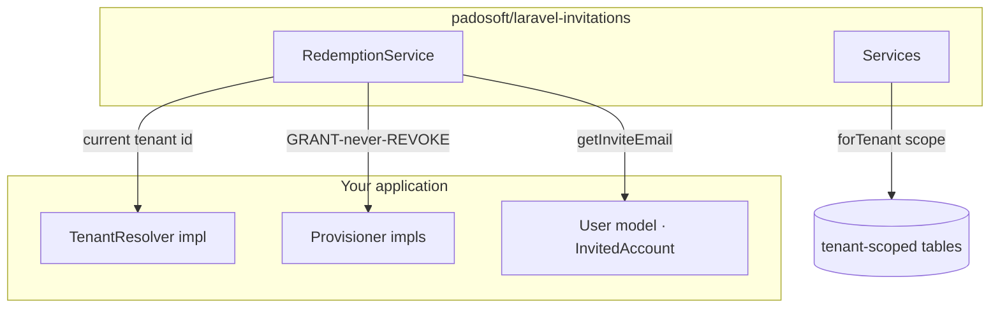

# Multi‑tenancy & host seams

## Motivation

Most invite packages make codes **globally unique**. That breaks the moment two customers of the same
SaaS both want the intuitive code `WELCOME2025`, and it risks rows leaking across customer boundaries
— a GDPR catastrophe. A package that wants to power a multi‑tenant product has to make the **tenant**
the unit of isolation, not the global table.

At the same time, the engine must stay **vendor‑neutral**: it cannot hard‑code your User model, your
tenancy package, or your permission system. It solves both with one idea — *tenant‑scoped rows behind
three small host seams*.

## Theory — the isolation boundary

Every domain table carries a `tenant_id` column, and every composite unique constraint **starts** with
it:

$$
\texttt{UNIQUE(tenant\_id, code)} \qquad \texttt{UNIQUE(tenant\_id, referee\_id)} \qquad \texttt{UNIQUE(tenant\_id, key)}
$$

Uniqueness is therefore *per tenant*. Two tenants $t_1 \ne t_2$ may both hold a code with the same
string `c`:

$$
(t_1, c) \ne (t_2, c)
$$

Every read and write is scoped through a `forTenant($tenantId)` query scope (the `BelongsToTenant`
trait), and the active tenant comes from a single resolver. The application‑layer scope — not a
foreign key — is the cross‑tenant boundary, exactly as in the host AskMyDocs codebase (rule R30).

## Design — the three seams



| Seam | Interface | Default | Override when… |
|---|---|---|---|
| Tenant scope | `Contracts\TenantResolver` | `DefaultTenantResolver` → `'default'` | you are multi‑tenant — bind your own resolver |
| Provisioning | `Contracts\Provisioner` (tag `invitations.provisioners`) | `SpatiePermissionProvisioner` (role grant) | you grant more on redemption (team / project membership) |
| Account identity | `Contracts\InvitedAccount` | `InteractsWithInvitations` trait | your user model stores email differently |

### TenantResolver

```php
interface TenantResolver
{
    public function current(): string; // the active tenant id
}
```

`DefaultTenantResolver` always returns the configured `default_tenant` (`'default'`), so a
single‑tenant app needs zero configuration. A multi‑tenant host binds its own:

```php
$this->app->bind(
    \Padosoft\Invitations\Contracts\TenantResolver::class,
    fn () => new MyTenantResolver(app(MyTenantContext::class)),
);
```

### Provisioner (GRANT‑never‑REVOKE)

On a fresh claim, the engine provisions the redeemer from the invite's `grant` (a per‑code override
falling back to the campaign default). Provisioners are **additive only** — an invite can raise
access (grant a role, `firstOrCreate` a membership) but never downgrade it. Provisioning is
**best‑effort**: a provisioner fault is swallowed and logged, never failing an already‑committed
redemption.

```php
$this->app->tag([MyProjectMembershipProvisioner::class], 'invitations.provisioners');
```

The default `SpatiePermissionProvisioner` grants a role when `spatie/laravel-permission` is present;
project / team membership is the one genuinely host‑specific seam and ships as a host‑supplied
provisioner.

### InvitedAccount

```php
interface InvitedAccount
{
    public function getInviteEmail(): ?string;
}
```

The `InteractsWithInvitations` trait satisfies it from the model's `email` attribute. The engine never
references a concrete `App\Models\User`; the class is configurable via `INVITATIONS_USER_MODEL`.

## Data model / contract

Every tenant‑aware table follows the same shape:

```php
$table->string('tenant_id', 50)->default('default')->index();
// …domain columns…
$table->unique(['tenant_id', /* natural key */], 'uq_…');
```

The `default('default')` keeps single‑tenant and legacy rows valid with no migration dance, mirroring
the host platform's backward‑compatibility convention.

## ADR

::: collapsible "ADR · Application-layer tenant scope, not a tenant-keyed FK"
**Problem.** Cross‑tenant isolation could be enforced with composite foreign keys that include
`tenant_id`, or at the application layer via a mandatory query scope.

**Decision.** Intra‑tenant referential integrity uses FKs; the cross‑*tenant* boundary is the
mandatory `forTenant()` scope (R30), because `tenant_id` is shared across customers and a tenant‑keyed
FK rebuild was judged not worth the migration cost.

**Consequences.** Every query against a tenant‑aware model **must** be scoped — an unscoped
`where('code', …)` would return a mix across tenants and is a bug. The upside is a simple schema and
free single‑tenant operation; the discipline cost is enforced by tests in the host integration.
:::

## Worked example — two tenants, same code

```php
// Tenant "acme"
app()->bind(TenantResolver::class, fn () => new FixedTenant('acme'));
$a = app(CodeGenerator::class)->mintVanity('WELCOME2025');

// Tenant "globex"
app()->bind(TenantResolver::class, fn () => new FixedTenant('globex'));
$g = app(CodeGenerator::class)->mintVanity('WELCOME2025'); // ✅ not a collision

assert($a->code === $g->code);          // same human string
assert($a->tenant_id !== $g->tenant_id); // different isolation boundary
```

::: callout warning
A bare `where('tenant_id', $x)` that mixes canonical and non‑canonical state, or any query that omits
the tenant scope, leaks rows across customers. Always go through `forTenant()` / the `BelongsToTenant`
trait. Cross‑tenant leakage is a GDPR incident, not a cosmetic bug.
:::
