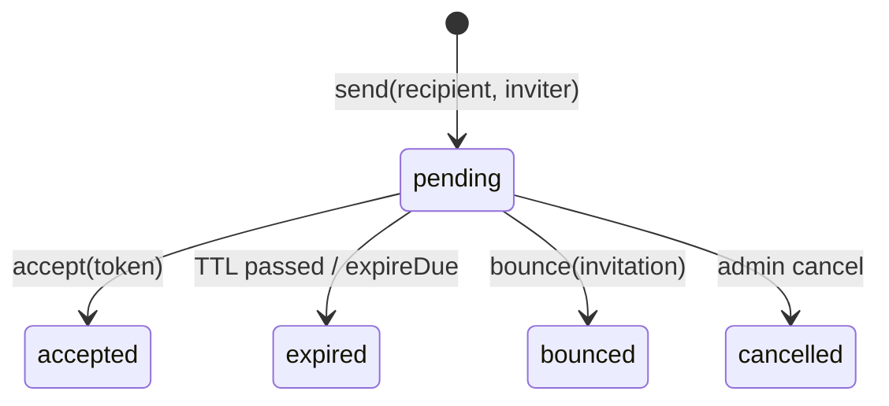

# Email invitations

## Motivation

Codes are one acquisition channel; **targeted email invitations** are another. They answer a question
codes can't: *who did we invite, and who actually accepted?* `InvitationService` runs the lifecycle
idempotently, with a high‑entropy link token and a clean status machine.

## The lifecycle



### Send

```php
$invitation = app(InvitationService::class)->send('alice@example.com', $inviter, [
    'campaign_id' => $campaign->id,
]);
// status = 'pending'; a CSPRNG token (INVITE_TOKEN_BYTES, default 32) is minted
```

Send is **idempotent** for a recipient with a still‑`pending` invitation — it returns the existing one
rather than spamming a second email. The `InvitationSent` event fires so you can queue the mail.

### Accept

```php
$invitation = app(InvitationService::class)->accept($token, $accepter);
// null if the token is unknown or not pending; auto-expires a TTL-passed token
```

Accept flips `pending → accepted` (stamping `accepted_at`), and only a `pending`, non‑expired token is
acceptable. The `InvitationAccepted` event fires once.

### Bounce & expire

```php
app(InvitationService::class)->bounce($invitation);   // pending → bounced (hard-bounce webhook)
app(InvitationService::class)->expireDue();            // bulk pending → expired past TTL
```

## Theory — the token

The link token is `INVITE_TOKEN_BYTES` of CSPRNG entropy (default 32 bytes = 256 bits), so it is
unguessable and safe to carry in a URL. It is **not** the redeemable code — it identifies the
invitation row; redemption still flows through the [atomic claim](/architecture/pipeline). On erasure
the token is nulled along with the recipient.

## Who accepted vs. who didn't

Because every invitation carries a status and `sent_at` / `accepted_at` timestamps, the
[analytics read model](/concepts/analytics) computes acceptance directly:

$$
\text{acceptance rate} = \frac{|\{\text{status} = \texttt{accepted}\}|}{|\{\text{sent\_at} \ne \text{null}\}|}
$$

## Data model / contract

`Invitation` statuses: `pending`, `accepted`, `expired`, `cancelled`, `bounced`. Columns include the
tenant‑scoped `recipient` (PII — erasable), the high‑entropy `token`, `campaign_id`, `sent_at`,
`accepted_at`, and `expires_at`.

## ADR

::: collapsible "ADR · Idempotent send per pending recipient"
**Problem.** A retried request or an impatient operator could send the same person several invitations.

**Decision.** `send()` returns the existing `pending` invitation for a recipient instead of creating a
duplicate.

**Consequences.** No accidental double‑emails; the "who did we invite" read stays one‑row‑per‑target
while an invitation is live. A new invitation is only minted once the prior one is resolved
(accepted / expired / cancelled / bounced).
:::

## Worked example — pending count for the current user

```php
$count = app(RedemptionService::class)->pendingCount($user); // or via:
$count = app(InvitationService::class)->pendingCountFor($user->email);
```

The same value is exposed at `GET /api/invitations/pending-count`. See
[The HTTP API](/operations/http-api).

::: callout warning
The token is the link secret, not the redeemable seat. Don't treat acceptance as a granted seat —
acceptance records intent; the seat is claimed only through the atomic redemption path.
:::
