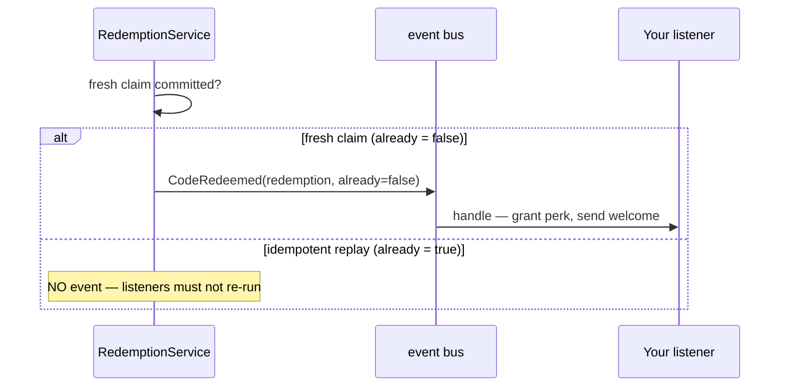

# Domain events

## Motivation

The host needs to react to invite lifecycle transitions — grant perks, send a welcome email, update
its own projections — without the engine knowing anything about the host. Domain events are the seam:
the engine fires, the host listens. The community's #1 gap in competing packages is *no events*; this
package fires one on every meaningful transition.

## The events

| Event | Fired when | Payload |
|---|---|---|
| `CodeRedeemed` | a **fresh** seat claim commits (never on a replay) | `Redemption $redemption`, `bool $already` |
| `InvitationSent` | an email invitation is sent | `Invitation $invitation` |
| `InvitationAccepted` | a pending invitation is accepted | `Invitation $invitation` |

All three are plain, immutable value objects with constructor‑promoted public readonly properties.

## The fire‑once contract



`CodeRedeemed` carries `$already`, but the engine only dispatches it on a **fresh** claim (`already`
is `false` at dispatch). Listener side effects — perks, welcome mail, projection updates — therefore
run **exactly once** per genuine redemption, never on a double‑click or a retried request.

## Listening

```php
use Illuminate\Support\Facades\Event;
use Padosoft\Invitations\Events\CodeRedeemed;

Event::listen(function (CodeRedeemed $e) {
    // $e->redemption->redeemer_id, ->code_id, ->tenant_id
    GrantWelcomeBonus::dispatch($e->redemption->redeemer_id);
});
```

Or a dedicated listener class registered in your `EventServiceProvider`.

## ADR

::: collapsible "ADR · Fire CodeRedeemed only on a fresh claim"
**Problem.** A replay returns success too — should it re‑fire the event?

**Decision.** The event fires only when the claim is fresh; an idempotent replay dispatches nothing.

**Consequences.** Listeners can be written naïvely (grant the perk, send the mail) without guarding
against replays — the engine guarantees one fire per genuine redemption. This mirrors the idempotency
guarantee of the redemption itself.
:::

## Worked example — grant a referrer bonus on a qualified referral

```php
Event::listen(function (CodeRedeemed $e) {
    $referral = $e->redemption->referral; // null if un-attributable
    if ($referral !== null) {
        // Qualify later when the referee activates; rewards grant on qualification.
        QueueActivationCheck::dispatch($referral->id);
    }
});
```

::: callout tip
Referral attribution and provisioning happen **inside** the redemption path before the event fires, so
`CodeRedeemed` is a safe place to read the attributed referral and the provisioned account state.
:::
