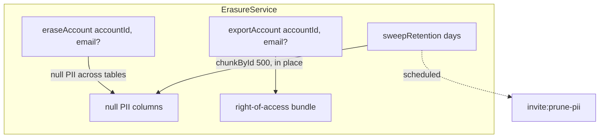

# GDPR & data privacy

## Motivation

An invite system collects PII — invitee emails, IPs, device fingerprints — exactly the data GDPR
demands you minimize, retain only as long as needed, and erase on request. Competing packages store
emails forever with no erasure path. This package treats privacy as a first‑class invariant: PII is
**hashed, retention‑swept, and erasable** — and erasure **never** corrupts the aggregates the business
depends on.

## Theory — the cardinal rule

> Anonymization overwrites PII **columns** in place. It never deletes rows.

Let a redemption row contribute to `current_uses`, the funnel counts, and the K‑factor. If erasure
deleted the row, every aggregate would shift. Instead, erasure nulls only the PII columns
(`ip`, `user_agent`, `fingerprint`, `recipient`, `token`) and leaves `redeemed_at` and the row
identity intact:

$$
\text{after erasure:}\quad \texttt{current\_uses},\ \text{funnel counts},\ K \;=\; \text{unchanged}
$$

PII that is stored at all is stored as a **salted HMAC**, never plaintext:

$$
h = \operatorname{HMAC\text{-}SHA256}(\text{value},\ \texttt{INVITE\_PII\_SALT})
$$

and network fields (`ip` / `fingerprint`) are only persisted when
`pii.store_network_fields` is explicitly enabled — off by default.

## The three operations



### Retention sweep

`invite:prune-pii` anonymizes redemption network fields, abuse‑signal PII subjects, and resolved
invitation recipients older than the retention window — in place, memory‑safely (`chunkById`):

```bash
php artisan invite:prune-pii --days=90        # override INVITE_PII_RETENTION_DAYS
php artisan invite:prune-pii --dry-run         # count rows without writing
php artisan invite:prune-pii --tenant=acme     # scope to one tenant
```

`--days=0` disables the rotation (the repo scheduler convention).

### Right‑to‑be‑forgotten

```php
$summary = app(ErasureService::class)->eraseAccount($accountId, $email);
// nulls ip/user_agent/fingerprint on redemptions, recipient+token on invitations,
// and hashed abuse-signal subjects — across every invite table, tenant-scoped.
```

### Right‑of‑access

```php
$bundle = app(ErasureService::class)->exportAccount($accountId, $email);
// { account_id, redemptions[], referrals_made[], referrals_received[], rewards[], invitations[] }
```

A typed, tenant‑scoped export of everything the invite subsystem holds about one account.

## Data model / contract

`ErasureService::sweepRetention(int $days, bool $dryRun, ?string $tenantId): array` returns a count
summary `{ redemptions, abuse_signals, invitations }`. The erased sentinel for hashed subjects is the
literal `'erased'`, so a swept row is never re‑swept.

## ADR

::: collapsible "ADR · Anonymize-in-place, never delete"
**Problem.** GDPR erasure conflicts with keeping accurate aggregates.

**Decision.** Overwrite PII columns; keep the row. PII is HMAC‑hashed at rest; network fields are
opt‑in.

**Consequences.** Erasure and retention sweeps satisfy GDPR while `current_uses`, funnel counts, and
K‑factor stay exact. The cost is that an erased row still exists (with no PII) — which is the point:
the *facts* the business needs survive, the *person* does not.
:::

::: collapsible "ADR · Salted HMAC, not reversible encryption"
**Problem.** Abuse review needs to correlate the same IP / email across signals, but storing plaintext
is a liability.

**Decision.** Store a salted HMAC of the canonical value. Correlation works (same input → same hash);
recovery does not.

**Consequences.** The blocklist and velocity rules operate on hashes; a leaked database does not leak
raw PII. The salt (`INVITE_PII_SALT`) must be set in production and rotated like any secret.
:::

## Worked example — scheduled sweep

```php
// In your scheduler:
$schedule->command('invite:prune-pii')->dailyAt('03:50')
    ->onOneServer()->withoutOverlapping();
```

::: callout warning
Set `INVITE_PII_SALT` in production. If it is unset the package derives material from `APP_KEY` so
nothing is stored unsalted by accident — but a dedicated, rotatable salt is the correct posture, and
rotating `APP_KEY` would otherwise orphan existing hashes.
:::
