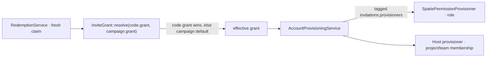

# Per‑invite entitlement grants

## Motivation

An invite is often more than "you may sign up" — it is "you may sign up **as an editor of these
projects**." `padosoft/laravel-invitations` carries an optional `grant` on each code (and campaign)
that the engine applies to the redeemer's account on a fresh claim, through the vendor‑neutral
[Provisioner seam](/concepts/multi-tenancy).

Two iron rules govern grants:

- **GRANT‑never‑REVOKE** — a grant can only *raise* access (add a role, `firstOrCreate` a membership).
  It never downgrades or removes anything.
- **Best‑effort** — provisioning faults are swallowed and logged; they **never** fail an
  already‑committed redemption.

## How a grant resolves



The per‑code `grant` **overrides** the campaign default; both may be absent (account‑creation‑only
codes). `AccountProvisioningService` fans the resolved grant out to every provisioner tagged
`invitations.provisioners`.

## Grant shape

The `grant` JSON (same shape on `invite_campaigns.grant` and `invite_codes.grant`):

```json
{
  "role": "editor",
  "projects": ["docs", "wiki"],
  "project_role": "member",
  "scope_allowlist": { "...": "host-defined" }
}
```

| Field | Meaning |
|---|---|
| `role` | the role the redeemer is granted (default `SpatiePermissionProvisioner`) |
| `projects` | tenant projects the redeemer gains access to (host provisioner) |
| `project_role` | the membership role within those projects |
| `scope_allowlist` | host‑defined fine‑grained scope |

A `null` grant means the campaign / code provisions nothing — account creation only.

## Writing a host provisioner

```php
use Padosoft\Invitations\Contracts\Provisioner;
use Padosoft\Invitations\Support\InviteGrant;

final class ProjectMembershipProvisioner implements Provisioner
{
    public function provision(object $account, InviteGrant $grant, string $tenantId): void
    {
        foreach ($grant->projects as $project) {
            // firstOrCreate — additive only, never a downgrade
            $account->memberships()->firstOrCreate(
                ['tenant_id' => $tenantId, 'project' => $project],
                ['role' => $grant->projectRole],
            );
        }
    }
}
```

Register it in a service provider:

```php
$this->app->tag([ProjectMembershipProvisioner::class], 'invitations.provisioners');
```

## ADR

::: collapsible "ADR · GRANT-never-REVOKE, best-effort, after the commit"
**Problem.** Should provisioning run inside the redemption transaction (atomic with the seat) or after
it (decoupled)?

**Decision.** Provisioning runs **after** the seat is committed, is best‑effort, and is additive only.

**Consequences.** A provisioner that throws (e.g. a downstream permission service is down) cannot
roll back a seat the user legitimately claimed; the fault is logged for retry. Because grants only
raise access, a partial provisioning leaves the account in a safe (under‑provisioned, never
over‑revoked) state.
:::

::: collapsible "ADR · Per-code grant overrides the campaign default"
**Problem.** Most codes in a campaign share a grant, but some need a different one (a VIP code, a
staff code).

**Decision.** `InviteGrant::resolve(code.grant, campaign.grant)` — the code's grant wins when present,
otherwise the campaign's default applies.

**Consequences.** A campaign sets the common case once; individual codes override without a separate
campaign. Both being null is valid (no provisioning).
:::

## Worked example — a beta campaign that grants editor on two projects

```php
$campaign = InviteCampaign::create([
    'key'   => 'beta-2025',
    'name'  => 'Closed beta',
    'type'  => InviteCampaign::TYPE_MULTI_USE,
    'grant' => ['role' => 'editor', 'projects' => ['docs', 'wiki'], 'project_role' => 'member'],
]);

// Codes inherit the campaign grant; one VIP code overrides it.
app(CodeGenerator::class)->generateBatch(50, ['campaign_id' => $campaign->id]);
app(CodeGenerator::class)->mintVanity('FOUNDER', [
    'campaign_id' => $campaign->id,
    'grant'       => ['role' => 'admin', 'projects' => ['docs', 'wiki', 'ops']],
]);
```

::: callout warning
Never write a provisioner that *removes* access — the engine's contract is additive. A provisioner
must also be safe to call twice (use `firstOrCreate` / additive role assignment), because the seat
claim is the idempotency anchor, not the provisioning step.
:::
