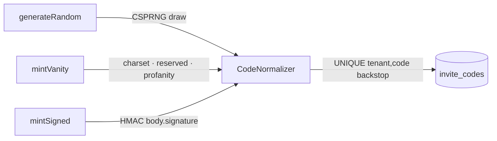

# Invite codes

## Motivation

A code is the atom of the system. It must be hard to mistype, impossible to confuse (`O` vs `0`),
collision‑safe at scale, and — for stateless distribution — self‑verifying without a database lookup.
`CodeGenerator` mints three kinds, all persisted in a single canonical form so the generator and the
[redeemer](/architecture/pipeline) always agree on identity.

## The three kinds



### Random

CSPRNG‑drawn (`random_int`, never `mt_rand`) over the Crockford Base32 alphabet, generate‑then‑check
with a `UNIQUE(tenant_id, code)` backstop and bounded retries.

```php
$code  = app(CodeGenerator::class)->generateRandom(['max_uses' => 100]);
$batch = app(CodeGenerator::class)->generateBatch(500); // 500 distinct codes
```

The default body length is 8 (≈ 40 bits of entropy). After `max_attempts` (default 5) collisions the
generator throws `collision_exhausted` — the signal to increase the length, not to retry forever.

### Vanity

Human‑chosen, run through a gauntlet — alphabet match, reserved‑word list, profanity fold — then the
same `UNIQUE` backstop:

```php
$code = app(CodeGenerator::class)->mintVanity('LAUNCH2025');
```

Rejections surface as typed reasons: `vanity_malformed`, `vanity_reserved`, `vanity_profane`,
`vanity_taken`. The offending term is never echoed back.

### Signed

A stateless, self‑verifying code. The payload (`campaign`, `capacity`, `exp` — **no PII**) is
Crockford‑encoded; the signature is an HMAC‑SHA256 over the body. The persisted code is
`body.signature`, and it survives normalization unchanged.

```php
$code = app(CodeGenerator::class)->mintSigned([
    'campaign' => 'beta',
    'capacity' => 1000,
    'exp'      => now()->addDays(30)->getTimestamp(),
]);

// Pure, constant-time, no DB hit:
$check = app(CodeGenerator::class)->verifySigned($raw);
// ['ok' => true, 'payload' => [...]] | ['ok' => false, 'reason' => 'bad_signature'|'expired']
```

## Theory — why Crockford Base32

The alphabet is `0123456789ABCDEFGHJKMNPQRSTVWXYZ` — it deliberately **omits** `I L O U`, the glyphs
humans confuse with `1` / `0` (and `U`, to avoid accidental profanity). With an alphabet of 32 symbols,
a code of length $\ell$ has

$$
\text{entropy} = \ell \cdot \log_2 32 = 5\ell \text{ bits}
$$

so the default $\ell = 8$ gives 40 bits ≈ $1.1\times10^{12}$ possibilities — ample headroom for the
generate‑then‑check loop to almost never collide. The generator **refuses** an alphabet that contains
the confusables or any duplicate, because normalization would fold two glyphs into one and silently
shrink the keyspace.

## Normalization is identity

`CodeNormalizer` uppercases, strips separators, and input‑folds Crockford confusables, so a user can
type `q7-k9 2mnp` and redeem `Q7K92MNP`. Both the generator and the redeemer normalize, so a code has
exactly one canonical identity per tenant.

## Data model / contract

`InviteCode` attributes you can set via `$attrs`: `campaign_id`, `issuer_id` (drives referral
attribution), `max_uses`, `expires_at`, `metadata`, `grant` (per‑code provisioning override),
`tenant_id` (auto‑filled). See [Data model](/architecture/data-model).

## ADR

::: collapsible "ADR · Generate-then-check with a UNIQUE backstop"
**Problem.** Guaranteeing uniqueness at mint time without a central allocator.

**Decision.** Draw a random code, attempt the insert, and rely on `UNIQUE(tenant_id, code)` to reject a
collision; retry up to `max_attempts`, then fail with `collision_exhausted`.

**Consequences.** No coordination needed across workers; collisions are self‑correcting. A persistent
`collision_exhausted` means the keyspace is too small for the issue volume — increase the length.
:::

## Worked example — a campaign batch with a grant

```php
$codes = app(CodeGenerator::class)->generateBatch(200, [
    'campaign_id' => $campaign->id,
    'max_uses'    => 1,
    'grant'       => ['role' => 'beta-tester'],
]);
```

::: callout warning
Do not add `I`, `L`, `O`, or `U` back into the alphabet, and do not introduce duplicates — the
generator will throw `invalid_alphabet`, because normalization would otherwise collapse glyphs and
shrink the effective keyspace.
:::
