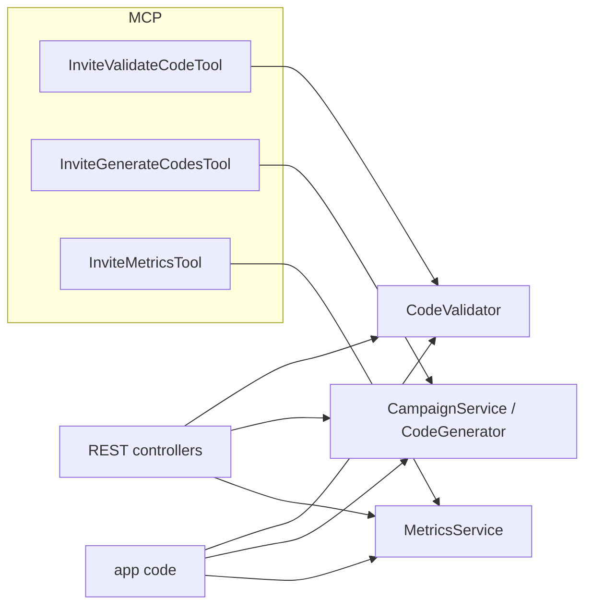

# The MCP surface

## Motivation

The third surface (after [PHP](/reference/php-api) and the [HTTP API](/operations/http-api)) is
[MCP](https://modelcontextprotocol.io) — so an AI agent or any MCP client can validate codes, mint
batches, and read virality metrics through a typed tool contract. Each tool is a **thin** adapter over
the *same* core service the other surfaces use (host rule R44) — never a parallel implementation.

## The bundled tools

| Tool | Surface | Core service | Annotations |
|---|---|---|---|
| `InviteValidateCodeTool` | read | `CodeValidator` | `IsReadOnly`, `IsIdempotent` |
| `InviteGenerateCodesTool` | write | `CampaignService` / `CodeGenerator` | — |
| `InviteMetricsTool` | read | `MetricsService` | `IsReadOnly`, `IsIdempotent` |

All three resolve the tenant from the MCP‑resolved `TenantResolver` (R30), so a tool call is scoped to
the caller's tenant exactly like an HTTP call.

## Registering the tools

`laravel/mcp` is an optional dependency. Add the tools to your MCP server's `$tools`:

```php
// app/Mcp/Servers/YourServer.php
use Laravel\Mcp\Server;

class YourServer extends Server
{
    public array $tools = [
        \Padosoft\Invitations\Mcp\Tools\InviteValidateCodeTool::class,
        \Padosoft\Invitations\Mcp\Tools\InviteGenerateCodesTool::class,
        \Padosoft\Invitations\Mcp\Tools\InviteMetricsTool::class,
    ];
}
```

## Tool contracts

::: tabs

== tab "Validate"

```text
InviteValidateCodeTool
input:  { code: string (required) }
output: { valid: true, code_kind, max_uses, current_uses }
      | { valid: false, error: "invalid"|"expired"|"exhausted"|"revoked"|"ineligible" }
```

Advisory — writes nothing. The error string is the canonical lowercase `RedemptionError` value.

== tab "Generate"

```text
InviteGenerateCodesTool
input:  { count: int 1..1000 (required),
          campaign_key?: string,
          max_uses?: int = 1,
          length?: int }
output: { codes: [string, ...] } | { error: "campaign_not_found", campaign_key }
```

Mints normalized Crockford codes with a `UNIQUE(code)` collision guard, optionally bound to a
tenant‑scoped campaign.

== tab "Metrics"

```text
InviteMetricsTool
input:  { campaign_id?: int, since_days?: int }
output: { k_factor, acceptance_rate, conversion_rate,
          ttr_p50_seconds, ttr_p90_seconds, ... }
```

The same summary as `MetricsService::summary()` — see [Virality analytics](/concepts/analytics).

:::

## Design — one core, three surfaces



## ADR

::: collapsible "ADR · MCP tools are thin adapters, never re-implementations"
**Problem.** It is tempting to inline logic in a tool's `handle()` for convenience.

**Decision.** A tool validates input, resolves the tenant, calls the core service, and shapes the
response — nothing else.

**Consequences.** A behaviour change (a new metric, a new validation rule) lands once in the service
and is reflected across PHP, HTTP, and MCP simultaneously. The tool registration count is asserted by a
test so a dropped or added tool is caught.
:::

## Worked example — agent reads K‑factor then tops up codes

```text
1. InviteMetricsTool { campaign_id: 7 } → { k_factor: 0.9, conversion_rate: 0.3, ... }
2. (agent decides the campaign needs more reach)
3. InviteGenerateCodesTool { count: 500, campaign_key: "beta-2025", max_uses: 1 }
   → { codes: ["Q7K9...", ...] }
```

::: callout tip
Because the metrics tool is `IsReadOnly` + `IsIdempotent`, MCP clients may cache or retry it freely.
The generate tool is a write — clients should not retry it blindly; a partial batch is still valid
(each code is independently persisted).
:::
