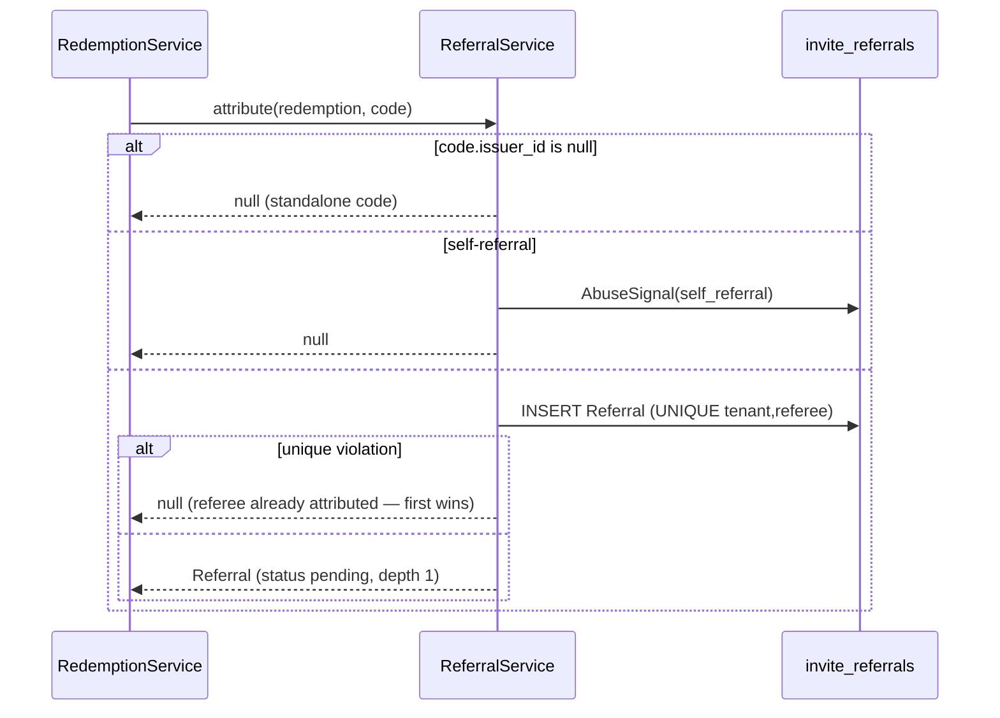
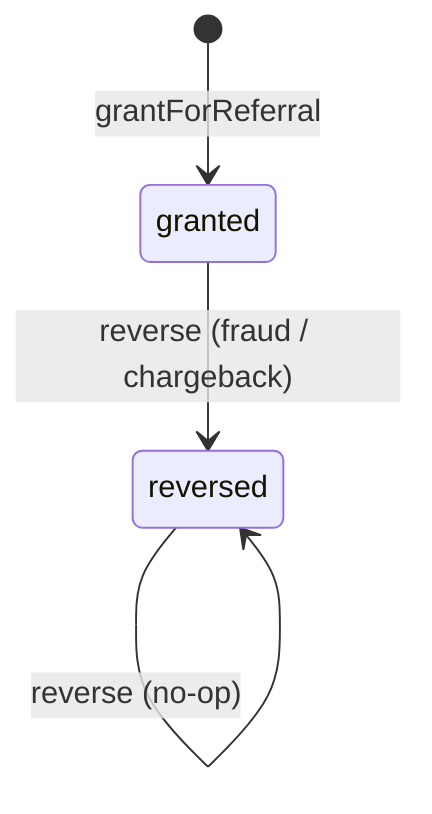

# Referrals & rewards

## Motivation

A referral program needs three things to be trustworthy: each referee is attributed to **one**
referrer (no double‑counting), each reward is granted **once** (no double‑payout), and a fraudulent
reward can be **reversed** without corrupting history. The `ReferralService` + `RewardEngine` pair
enforce all three with database invariants rather than bookkeeping.

## Attribution — first wins

When a code carries an `issuer_id`, a fresh redemption creates a `Referral` edge. Two invariants are
enforced in code *and* in the schema:

- **No self‑referral** — `referrer == referee` is rejected and emits an `AbuseSignal(self_referral)`.
- **One referrer per referee** — `UNIQUE(tenant_id, referee_id)`. A later attribution loses the race
  and is dropped silently, with **no error** to the caller.



## Qualification — idempotent

A referral starts `pending`. When the referee meets the activation bar, `qualify()` moves it
`pending → qualified` **once** (re‑firing does not re‑grant), records the funnel events, and triggers
the double‑sided reward grant. Once at least one reward lands, the referral moves to `rewarded`.

```php
$result = app(ReferralService::class)->qualify($referral);
// ['referral' => Referral, 'rewards' => [Reward, ...]]
```

## The reward ledger

`RewardEngine::grantForReferral()` grants the policy‑defined reward for one party (`referrer` /
`referee`). The double‑grant guard is **the database**: every reward carries a deterministic
`idempotency_key` and `UNIQUE(idempotency_key)` makes a replay a no‑op.

$$
\texttt{idempotency\_key} = \texttt{"reward:\{tenant\}:\{referral\}:\{party\}"}
$$



A **per‑referrer cap** (`reward_policy.per_referrer_total`) skips further referrer‑side grants and
emits a throttle `AbuseSignal` once a referrer saturates it. The grant is also passed through the
fail‑open [abuse gate](/concepts/anti-abuse): a blocked beneficiary simply doesn't get the grant — the
redemption itself already committed.

## Reward policy shape

A campaign's `reward_policy` JSON declares per‑party rewards and the cap:

```json
{
  "referrer": { "type": "credit", "amount": 10, "unit": "USD", "trigger": "on_activation" },
  "referee":  { "type": "credit", "amount": 5,  "unit": "USD" },
  "per_referrer_total": 50
}
```

`Reward` records carry `party`, `type`, `amount`, `unit`, `trigger`, `state` (`granted` / `reversed`),
the deterministic `idempotency_key`, and `granted_at` / `reversed_at`.

## ADR

::: collapsible "ADR · Idempotency key in the database, not in code"
**Problem.** A reward grant can be triggered concurrently (two qualification calls, a retried job).

**Decision.** A deterministic `idempotency_key` per `(referral, party)` with `UNIQUE(idempotency_key)`.
A concurrent grant that loses the race loads and returns the winner's reward.

**Consequences.** Exactly‑once payout under any interleaving, surviving restarts and concurrent
workers. The same pattern as the redemption idempotency anchor.
:::

::: collapsible "ADR · First-wins referee attribution, dropped silently"
**Problem.** Two codes might both claim to have referred the same new account.

**Decision.** `UNIQUE(tenant_id, referee_id)`; the first attribution wins, later ones are dropped with
no error.

**Consequences.** A referee has exactly one referrer; the caller never sees a confusing failure for a
late attribution. The edge that committed first is the canonical one.
:::

## Worked example — reverse a fraudulent reward

```php
use Padosoft\Invitations\Services\RewardEngine;

$reward = app(RewardEngine::class)->reverse($reward);
// state → 'reversed'; the source referral → 'reversed'; a second call is a no-op
```

::: callout warning
Reversal flips state; it does not delete the reward or the referral. The ledger stays auditable, and a
double reversal is idempotent.
:::
