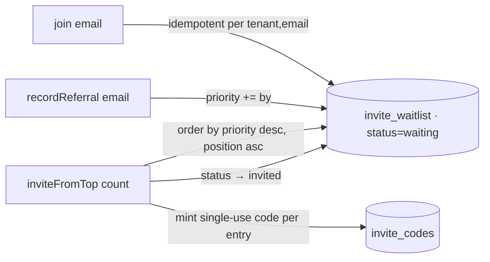

# Waitlist & queue‑jump

## Motivation

A waitlist is a growth lever when joining is **viral**: members climb the queue by referring others,
so the waitlist itself drives acquisition (the Dropbox / Robinhood pattern). `WaitlistService`
implements join, refer‑to‑jump, and convert‑the‑top — all tenant‑scoped and idempotent.

## The flow



### Join

Idempotent per `(tenant, email)` — re‑joining returns the existing entry and never resets its position
or priority. New entries take the next `position`.

```php
$entry = app(WaitlistService::class)->join('alice@example.com');
// status = 'waiting', position = N
```

### Refer to jump

A successful referral by a waitlisted member bumps both the referral count and the `priority` that
orders `inviteFromTop()`:

```php
$entry = app(WaitlistService::class)->recordReferral('alice@example.com', by: 1);
// referral_count += 1, priority += 1; null if the email isn't on the waitlist
```

### Invite from the top

Convert the highest‑priority waiting entries into real single‑use [invite codes](/guides/invite-codes)
and flip them to `invited`:

```php
$invited = app(WaitlistService::class)->inviteFromTop(100);
// each entry: status → 'invited', granted_code_id set, invited_at stamped
```

## Theory — the ordering

Entries are converted in **priority‑then‑position** order:

$$
\text{order} = \big(\,{-}\,\text{priority},\; \text{position}\,\big)
$$

i.e. highest priority first, ties broken by earliest join. Priority is `base + referral bumps`, so a
member who refers others overtakes earlier joiners who didn't — that is the queue‑jump incentive that
makes the waitlist viral.

## Data model / contract

`WaitlistEntry` carries `tenant_id`, the normalized `email`, `position`, `priority`, `referral_count`,
`status` (`waiting` / `invited`), `granted_code_id`, and `invited_at`. `UNIQUE(tenant_id, email)`
guarantees one entry per address per tenant.

## ADR

::: collapsible "ADR · Priority as the queue-jump lever, position as the tiebreaker"
**Problem.** A pure FIFO waitlist has no viral incentive; a pure priority queue is unfair to early
joiners with equal effort.

**Decision.** Order by `priority DESC, position ASC` — referrals raise priority, join order breaks
ties.

**Consequences.** Referring others is the only way to overtake, which is the growth incentive; among
equal referrers the earlier joiner wins. `recordReferral` is the single place priority changes.
:::

## Worked example — convert the top 100 weekly

```php
// Scheduled weekly: pull the 100 most-referred waiting members into the beta.
$invited = app(WaitlistService::class)->inviteFromTop(100);

foreach ($invited as $entry) {
    Mail::to($entry->email)->queue(new BetaInviteMail($entry->granted_code_id));
}
```

::: callout tip
`inviteFromTop()` mints a single‑use code per entry through the same `CodeGenerator` used everywhere
else — so the converted invite redeems through the same atomic, idempotent path as any other code.
:::
