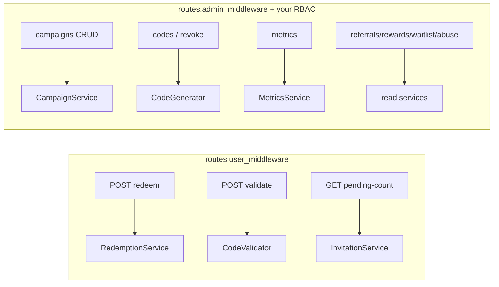

# The HTTP API

## Motivation

The HTTP API is the second [tri‑surface](/architecture/overview) layer: an RBAC‑gated REST surface over
the same core services. Controllers are thin — they validate, resolve the tenant, call a service, and
shape a `JsonResource`. The route file is **config‑driven**, so the host owns prefix and middleware.

## Auth model

Two route groups, each guarded by config middleware (see
[Configuration reference](/operations/configuration)):

| Group | Prefix | Middleware key | Default |
|---|---|---|---|
| User redemption | `{prefix}/invitations` | `routes.user_middleware` | `['web', 'auth']` |
| Admin management | `{prefix}/admin/invitations` | `routes.admin_middleware` | `['web', 'auth']` |

::: callout warning
Append your own `can:` / role middleware to `routes.admin_middleware` **before** exposing the admin
group — the defaults only require an authenticated user, not an authorized one. The package cannot know
your RBAC scheme; gating is the host's responsibility.
:::

## User redemption surface

```http
POST /api/invitations/redeem          { "code": "Q7K92MNP" }
POST /api/invitations/validate        { "code": "Q7K92MNP" }   # advisory, writes nothing
GET  /api/invitations/pending-count
```

| Route | Name | Purpose |
|---|---|---|
| `POST redeem` | `invitations.redeem` | atomic, idempotent, fraud‑gated claim |
| `POST validate` | `invitations.validate` | advisory validity check — no write |
| `GET pending-count` | `invitations.pending-count` | pending invitations for the current account |

`redeem` returns the [`RedemptionResult`](/concepts/atomic-redemption) shape; `validate` returns
`{ valid, … }` or `{ valid: false, error }`.

## Admin management surface

### Campaigns

```http
GET   /api/admin/invitations/campaigns
GET   /api/admin/invitations/tenants
POST  /api/admin/invitations/campaigns
GET   /api/admin/invitations/campaigns/{id}
PATCH /api/admin/invitations/campaigns/{id}
```

### Codes

```http
GET  /api/admin/invitations/codes
POST /api/admin/invitations/codes            { "count": 50, "max_uses": 1 }
POST /api/admin/invitations/codes/{id}/revoke
```

### Metrics & invitations

```http
GET  /api/admin/invitations/metrics          # k_factor, acceptance, conversion, TTR
POST /api/admin/invitations/invitations      # send an email invitation
```

### Domain read surfaces

```http
GET /api/admin/invitations/referrals
GET /api/admin/invitations/rewards
GET /api/admin/invitations/waitlist
GET /api/admin/invitations/abuse-signals
```

## Route map



## Worked example — mint then read metrics

```http
POST /api/admin/invitations/codes
Content-Type: application/json
{ "count": 100, "campaign_id": 7, "max_uses": 1 }

→ 201 { "data": { "codes": ["Q7K9...", ...] } }

GET /api/admin/invitations/metrics?campaign_id=7&since_days=30
→ 200 { "data": { "k_factor": 1.21, "conversion_rate": 0.41, ... } }
```

::: callout tip
The metrics endpoint, the `MetricsService` PHP call, and the `InviteMetricsTool` MCP tool all return
the same summary — one core, three surfaces (host rule R44).
:::
