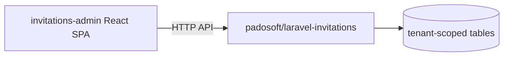

# Web admin panel

## Motivation

This package is headless — it owns the data, the services, and the API. For teams that want a UI
without building one, the companion package
[`padosoft/laravel-invitations-admin`](https://github.com/padosoft/laravel-invitations-admin) ships a
polished **React + Tailwind** admin SPA over this package's HTTP API.

## What it provides

A virality dashboard plus management screens for the whole acquisition suite:

::: grids
  ::: grid
    ::: card "Dashboard" icon:gauge
    K‑factor, acceptance / conversion funnel, time‑to‑redeem percentiles — the [analytics read model](/concepts/analytics) visualized.
    :::
  :::
  ::: grid
    ::: card "Campaigns & codes" icon:ticket
    Create campaigns, mint and revoke [codes](/guides/invite-codes), set reward policies and grants.
    :::
  :::
  ::: grid
    ::: card "Invitations" icon:mail
    Who was invited vs. who accepted — the [email invitation](/guides/email-invitations) read model.
    :::
  :::
  ::: grid
    ::: card "Referrals & rewards" icon:gift
    The referral graph and the [reward ledger](/guides/referrals-rewards) with reversal.
    :::
  :::
  ::: grid
    ::: card "Waitlist" icon:list-ordered
    The [queue‑jump waitlist](/guides/waitlist) and invite‑from‑top.
    :::
  :::
  ::: grid
    ::: card "Anti‑abuse review" icon:shield
    The [abuse signals](/concepts/anti-abuse) audit trail (hashed subjects).
    :::
  :::
:::

## Deployment model

- **Requires the core** `padosoft/laravel-invitations` package.
- **Prebuilt assets** are published — no JS toolchain to install in your app.
- **Default‑OFF, host‑gated** — a feature flag mounts the Blade SPA; when the flag is off the routes
  degrade to a clean 404, never a crash (the host platform's R43 both‑states rule).
- For apps that **already run their own React SPA**, the screens can be adapted natively instead of
  cross‑mounting — they call the same core HTTP API.



## Install

```bash
composer require padosoft/laravel-invitations-admin
# then enable the host-gated mount flag and publish the prebuilt assets per that package's README
```

::: callout tip
The admin SPA is a *consumer* of the core API — it adds no new business logic. Everything it shows is
served by the services documented here, so the [HTTP API](/operations/http-api) is the contract
between them.
:::
